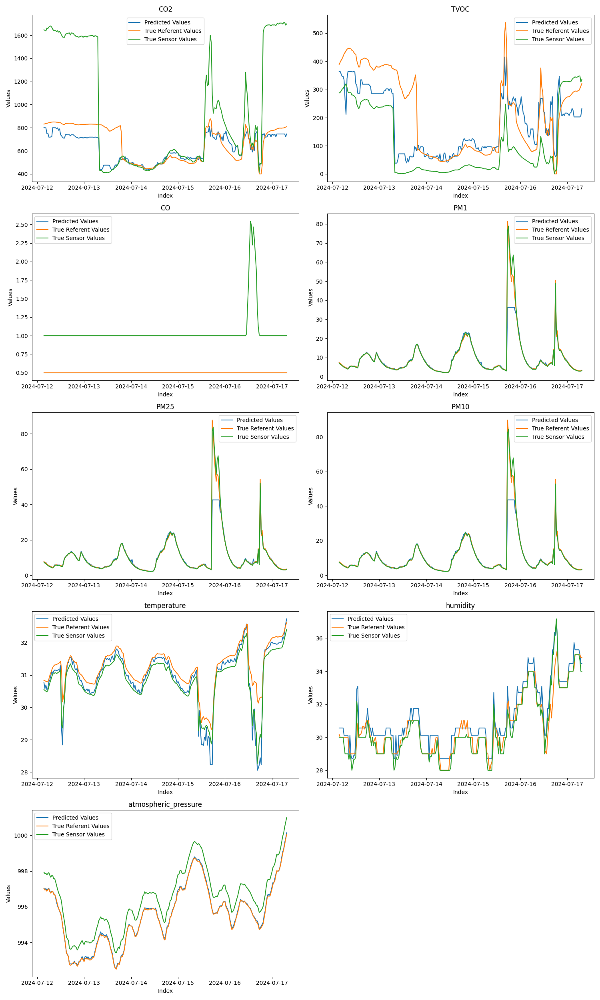

In this folder, you can find a notebook used for training a model that enhances low-cost sensor data using machine learning.

It is designed to generate predictions from the model that are better than those of the low-cost sensor and to improve their performance compared to the reference device.

For this notebook to run, you need two CSV files: one containing data from the reference sensor and the other from the low-cost sensor. The notebook is set up to load the CSV files, perform data preprocessing, optimize hyperparameters, and then train the models.

In this example, a simple random forest regression model is used.

All results are saved in a results folder that is created when the notebook is run.

To successfully run the notebook, you need Python 3.10 or higher and must install the required Python packages from the requirements.txt file using the command:

``` pip install -r requirements.txt ```

Here is a preview of the results:

